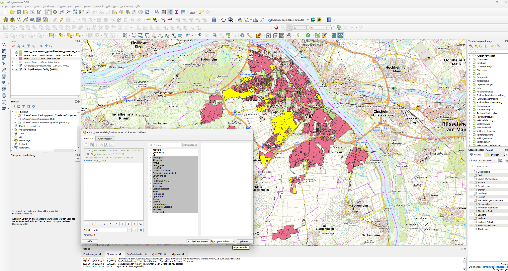
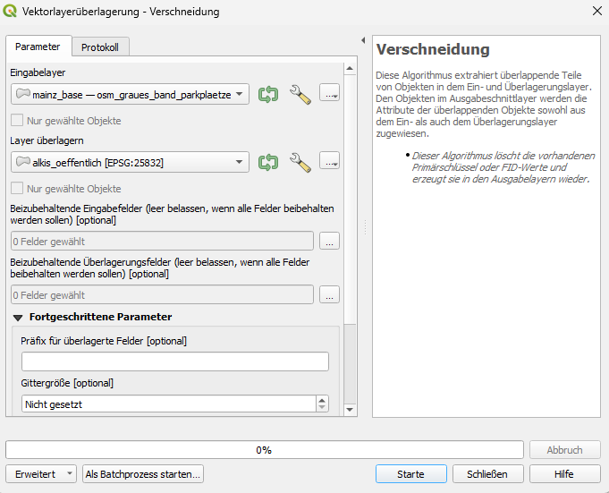
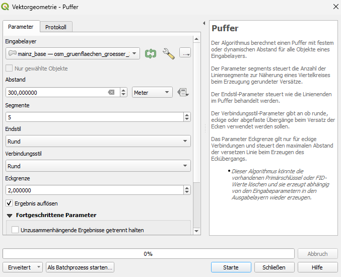
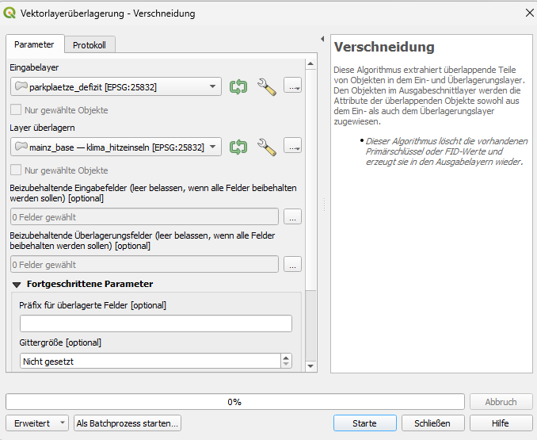
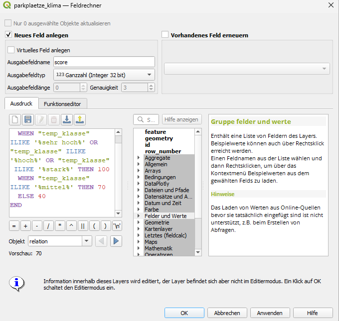

Hier ist die vollständig überarbeitete und praxiserprobte Fassung deiner `docs/SPICKZETTEL_QGIS.md`.

Die fünf Screenshots (`01_filter.png` bis `05_field_calculator.png`) sind direkt an den passenden Stellen eingebunden, die Layer- und Spaltennamen entsprechen exakt der Mainzer Datenbasis (inklusive `temp_klasse` und `ILIKE`-Toleranz), und die Phase 2 der Attributberechnung ist vollständig ausformuliert:

```markdown
# 🛠️ QGIS-Spickzettel: Multi-Kriterien-Analyse (MCE)

Dieser Leitfaden führt Schritt für Schritt durch alle Werkzeuge, um aus den Rohdaten priorisierte Entsiegelungsflächen abzuleiten.

---

## Schritt 1: Rechtliche Machbarkeit filtern (ALKIS)

**Ziel:** Nur Flurstücke behalten, die sich im öffentlichen Eigentum befinden.

1. Wähle den Layer `alkis_flurstuecke` (bzw. `mainz_base — alkis_flurstuecke`) im Layer-Fenster an.
2. Drücke **`F6`** (Attributtabelle öffnen) oder klicke auf das Tabellen-Symbol.
3. Klicke oben auf **Nach Ausdruck wählen** (`Strg + F3` bzw. das $\varepsilon$-Symbol).
4. Gib folgenden Filterausdruck ein:

```sql
"t_eigentuemer" ILIKE '%öffentlich%' OR "t_eigentuemer" ILIKE '%Gemeinde%' OR "t_eigentuemer" ILIKE '%Land%'

```



> **Syntax-Hinweis:**
> * `"t_eigentuemer"`: Doppelte Anführungszeichen kennzeichnen immer Feld- bzw. Spaltennamen in QGIS.
> * `ILIKE`: Vergleicht Zeichenketten ohne Beachtung von Groß- und Kleinschreibung (`Gemeinde` vs. `gemeinde`).
> * `%`: Wildcard-Platzhalter für beliebige Zeichen vor oder nach dem Suchbegriff.
> * `OR`: Logisches Oder – trifft zu, wenn mindestens eine Bedingung wahr ist.
> 
> 

5. Klicke auf **Objekte wählen** und schließe das Dialogfenster.
6. Rechtsklick auf den Layer ➔ **Exportieren ➔ Gewählte Objekte speichern als...**:
* **Format:** GeoPackage
* **Dateiname:** `data/analyse_temp.gpkg`
* **Layername:** `alkis_oeffentlich`
* **KBS:** Projekt-KBS beibehalten (`EPSG:25832` bzw. `EPSG:25833`)


7. Klicke auf **OK**.

---

## Schritt 2: Potenzialflächen zuschneiden (OSM & ALKIS)

**Ziel:** Straßenbegleitende Parkplätze auf öffentlich gesicherte Grundstücke begrenzen.

1. Menüleiste: **Vektor ➔ Geoverarbeitungswerkzeuge ➔ Verschneidung (Intersection)...**
* **Eingabelayer:** `mainz_base — osm_graues_band_parkplaetze`
* **Überlagerungslayer:** `alkis_oeffentlich`
* **Verschneidung:** Als Layer `parkplaetze_oeffentlich` in `data/analyse_temp.gpkg` speichern


2. Klicke auf **Starte**.
   


---

## Schritt 3: Grünraumdefizit ermitteln (Pufferung & Differenz)



**Ziel:** Prüfen, welche Flächen außerhalb des 300-Meter-Einzugsbereichs großer Parkanlagen (> 2 ha) liegen.

1. Menüleiste: **Vektor ➔ Geoverarbeitungswerkzeuge ➔ Puffer (Buffer)...**
* **Eingabelayer:** `mainz_base — osm_gruenflaechen_groesser_2ha`
* **Abstand:** `300` Meter
* **Ergebnis auflösen (Dissolve):** Häkchen zwingend setzen!
* **Ausgabe:** Als Layer `parks_puffer_300m` speichern


> **Syntax-Hinweis:**
> * **Abstand / Distance:** Richtet sich nach den Einheiten des KBS (bei `EPSG:25832` / `EPSG:25833` immer in Metern). Niemals Grad-Werte (WGS 84) bei Pufferungen nutzen!
> * **Ergebnis auflösen (Dissolve):** Verschmilzt überlappende Pufferkreise zu einem zusammenhängenden Polygon und verhindert Doppelungen beim Verschneiden.
> 
> 

2. Klicke auf **Starte**.
3. **Defizitflächen außerhalb isolieren:**
* Menüleiste: **Vektor ➔ Geoverarbeitungswerkzeuge ➔ Differenz (Difference)...**
* **Eingabelayer:** `parkplaetze_oeffentlich`
* **Überlagerungslayer:** `parks_puffer_300m`
* **Ausgabe:** `parkplaetze_defizit`


4. Klicke auf **Starte**.

---

## Schritt 4: Thermische Belastung verschneiden (Hitzeinseln)



**Ziel:** Stadtklimatische Belastungsdaten an die identifizierten Defizitflächen koppeln.

1. Menüleiste: **Vektor ➔ Geoverarbeitungswerkzeuge ➔ Verschneidung (Intersection)...**
* **Eingabelayer:** `parkplaetze_defizit`
* **Überlagerungslayer:** `mainz_base — klima_hitzeinseln`
* **Ausgabe:** `parkplaetze_klima`


2. Klicke auf **Starte**.

---

## Schritt 5: Attributberechnung & Priorisierung (Feldrechner)

Öffne die Attributtabelle von `parkplaetze_klima` (`F6`) und starte den **Feldrechner** (`Strg + I`).

### 1. Flächengröße in Quadratmetern berechnen (`flaeche_m2`):

* Häkchen bei **Neues Feld anlegen**.
* **Feldname:** `flaeche_m2` | **Feldtyp:** Ganze Zahl (Integer 32-bit)
* **Ausdruck:**
```sql
round($area, 0)

```


* Klicke auf **OK**.

### 2. MCE-Basis-Score berechnen (`score`):

* Häkchen bei **Neues Feld anlegen**.
* **Feldname:** `score` | **Feldtyp:** Ganze Zahl (Integer 32-bit)
* **Ausdruck:**
```sql
CASE 
  WHEN "temp_klasse" ILIKE '%sehr hoch%' OR "temp_klasse" ILIKE '%hoch%' OR "temp_klasse" ILIKE '%stark%' THEN 100
  WHEN "temp_klasse" ILIKE '%mittel%' THEN 70
  ELSE 40
END


```


* Klicke auf **OK**.

### 3. Prioritätsstufe vergeben (`prioritaet`):

* Häkchen bei **Neues Feld anlegen**.
* **Feldname:** `prioritaet` | **Feldtyp:** Text (String), Länge `20`
* **Ausdruck:**
```sql
CASE 
  WHEN "temp_klasse" ILIKE '%sehr hoch%' AND "flaeche_m2" >= 150 THEN 'Hoch'
  WHEN "temp_klasse" ILIKE '%hoch%' OR "temp_klasse" ILIKE '%stark%' THEN 'Mittel'
  ELSE 'Niedrig'
END

```


* Klicke auf **OK**.

### 4. Schwammstadt-Maßnahme zuweisen (`massnahme`):

* Häkchen bei **Neues Feld anlegen**.
* **Feldname:** `massnahme` | **Feldtyp:** Text (String), Länge `60`
* **Ausdruck:**
```sql
CASE 
  WHEN "flaeche_m2" >= 300 THEN 'Pocket-Park mit Retentionsmulde'
  WHEN "flaeche_m2" >= 100 THEN 'Baumrigole & Sickerpflaster'
  ELSE 'Entsiegelter Baumstandort'
END

```


* Klicke auf **OK**.
* Klicke oben links auf die **Diskette** (`Strg + S`) und beende den Bearbeitungsmodus über den **Stift** (`Strg + E`).

---

## Schritt 6: Übergabe-Export (`ergebnis.geojson`)

1. Rechtsklick auf `parkplaetze_klima` ➔ **Exportieren ➔ Objekte speichern als...**
2. **Format:** `GeoJSON`
3. **Dateiname:** Über `...` navigieren zu `data/ergebnis.geojson`
4. **KBS:** Zwingend auf **`EPSG:4326 - WGS 84`** umstellen!
5. Klicke auf **OK**.

---

## ⚠️ Typische Fallstricke & Troubleshooting

* **Fehler: `GEOS exception: TopologyException / Invalid Geometry**`
* *Ursache:* OSM- oder ALKIS-Polygone enthalten minimale Selbstüberschneidungen.
* *Lösung:* Verarbeitungsleiste ➔ Werkzeug **Geometrien reparieren (Fix geometries)** über den Eingabelayer laufen lassen.


* **Problem: Fläche (`flaeche_m2`) ist 0 oder hat winzige Kommazahlen**
* *Ursache:* Die Berechnung wurde ausgeführt, nachdem der Layer in WGS 84 konvertiert wurde (Berechnung in Quadratgrad statt Quadratmetern).
* *Lösung:* Flächenberechnungen immer im metrischen Projekt-KBS (`EPSG:25832` / `EPSG:25833`) vor dem GeoJSON-Export durchführen.


* **Problem: Einteilige Parkstreifen hängen zusammen (MultiPolygon)**
* *Ursache:* Geoverarbeitungen fassen getrennte Polygone als Multipart-Objekt zusammen.
* *Lösung:* **Vektor ➔ Geometrie-Werkzeuge ➔ Mehrteilige in einteilige Objekte zerlegen (Multipart to singleparts)** zwischenschalten.


* **Problem: `NULL`-Werte bei der Temperaturklasse**
* *Ursache:* Randflächen außerhalb des Modellausschnitts.
* *Lösung:* Im Feldrechner mit Fallback arbeiten: `COALESCE("temp_klasse", 'Mittel')`.

